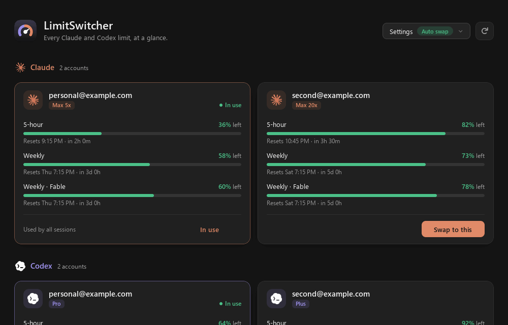
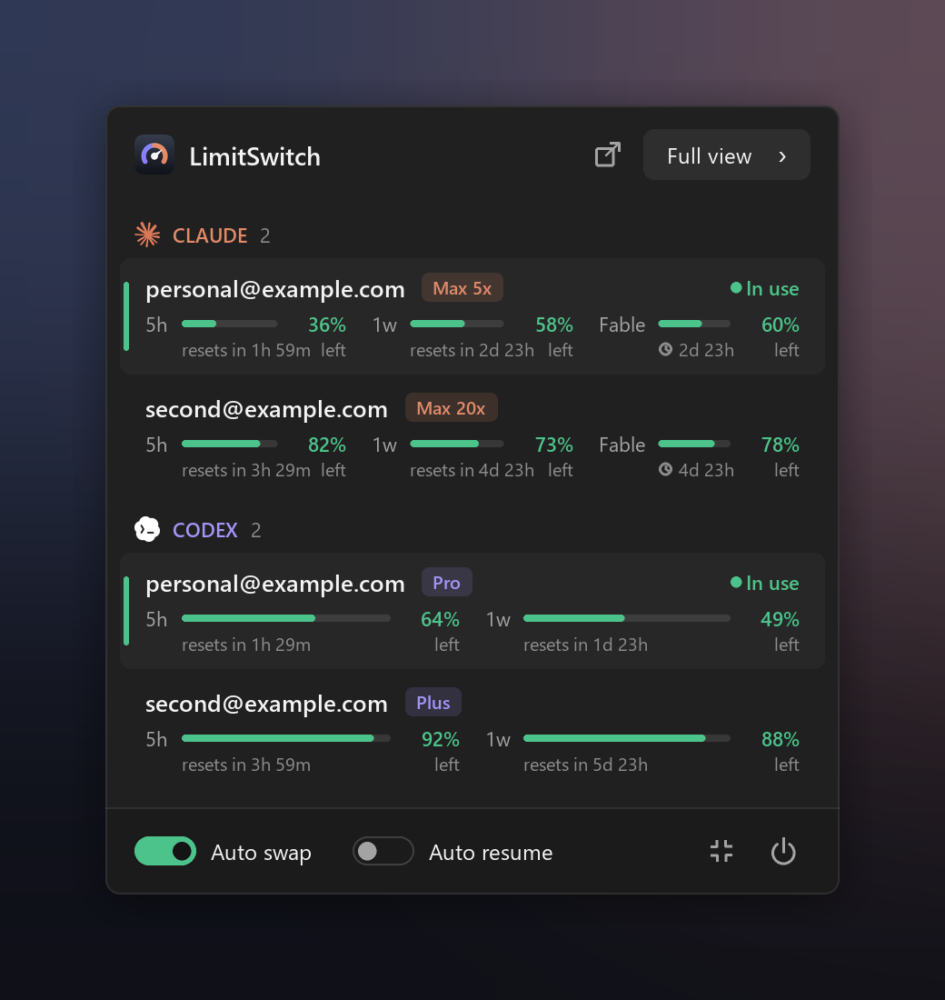
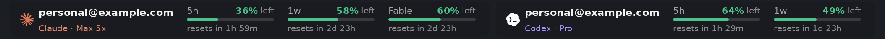

# LimitSwitcher

A Windows tray / macOS menu bar app that shows every Claude Code and Codex usage limit at a glance, switches accounts in one click, and can switch automatically when the account in use hits a limit.



<p align="center"></p>

**On the taskbar** (Windows): the accounts in use sit right on the taskbar, and step aside for full-screen apps.



## Why not something else?

I made this mainly for myself and decided to publish it on GitHub. Nothing else (at the time) did what I wanted:

- **Usage trackers** show your limits, but don't switch accounts for you.
- **Account switchers** swap logins, but you have to notice the limit yourself, and sessions that are already open often need a restart.
- **Few cover both** Claude Code and Codex, and fewer run on Windows.
- **Most are heavy.** I'm a performance fanatic, and I didn't want a browser engine or an Electron app sitting in my tray all day just to show a few numbers.

LimitSwitcher does all of it in one small tray app: every limit at a glance, one-click switching that open sessions pick up, and Auto swap / Auto resume, so a long task keeps going when an account runs out.

## Install (Windows)

Download **`LimitSwitcher-Setup.exe`** from the [latest release](https://github.com/doge006/LimitSwitch/releases/latest) and run it. It installs for your Windows user only (no admin rights), asks where to put it (`%LOCALAPPDATA%\Programs\LimitSwitcher` by default), and has boxes for a Start menu entry (on) and a desktop shortcut (off). It starts in the tray when you sign in; turn that off in Settings. It brings its own Python, so nothing else is needed.

Windows may say "Windows protected your PC" the first time, because the installer isn't code-signed: click **More info → Run anyway**.

Your accounts and settings are kept in `%LOCALAPPDATA%\AccountSwitcher` (the app's name before it was renamed), so updating, reinstalling or uninstalling keeps them. Uninstall from **Settings → Apps**; it closes the app and puts the Codex and Claude Code settings back first.

**Updates:** the app checks GitHub Releases once at launch and tells you when a new version is out. Settings → **Update to …** downloads the new installer, which closes the app, replaces its files and starts it again. **Check for updates** checks now.

## Install (macOS)

Paste this into Terminal:

```sh
curl -fsSL https://raw.githubusercontent.com/doge006/LimitSwitch/main/scripts/install-mac.sh | bash
```

It downloads the right version for your Mac (Apple silicon or Intel) from the [latest release](https://github.com/doge006/LimitSwitch/releases/latest), puts **LimitSwitcher** in Applications and opens it. It brings its own Python, so nothing else is needed. Running the same command again updates it.

Prefer to click? Download `LimitSwitcher-AppleSilicon.dmg` or `LimitSwitcher-Intel.dmg` from the latest release and drag the app to Applications. The app isn't notarized by Apple (that needs a paid developer account), so macOS blocks it the first time: open **System Settings → Privacy & Security** and click **Open Anyway**. The Terminal command avoids that, because macOS only checks apps downloaded by a browser.

It lives in the menu bar (no Dock icon) and starts there when you log in; turn that off in Settings. Your accounts and settings are kept in `~/Library/Application Support/AccountSwitcher`. **Updates:** Settings → **Update to …** runs the same install for you. See [macOS](#macos) below for how it works there.

## Performance

Built to be barely noticeable:

- **One small process.** On Windows every window is native and drawn by the app itself: no browser, no Electron. (The macOS menu bar panel uses the system's own WebKit view, only while it's open.)
- **It sleeps** until an account is due for a usage check (every few minutes for the one in use, less often for the rest) or something changes, and uses no CPU in between.
- **Windows exist only while they're open.** The panel, the menus and the full view are created when you open them and freed when you close them, and animation frames are drawn only while something moves.
- **Checking usage doesn't touch your limits:** the usage endpoints it reads don't count against them.

### Measure it on Windows

In PowerShell, with LimitSwitcher running. This samples it over 60 seconds:

```powershell
$before = (Get-Process LimitSwitcher).CPU; Start-Sleep 60; $p = Get-Process LimitSwitcher
'{0:N1} MB memory ({1:N1} MB private), {2:N2}% of one CPU core' -f ($p.WorkingSet64 / 1MB), ($p.PrivateMemorySize64 / 1MB), (($p.CPU - $before) / 60 * 100)
```

Try it idle in the tray, with the panel open, and with the full view open. Task Manager shows it too, as **LimitSwitcher**.

### Measure it on macOS

In Terminal, with LimitSwitcher running. This samples it over 60 seconds:

```sh
pids=$(pgrep -f 'LimitSwitcher[.]pyw|MacOS/LimitSwitcher' | paste -sd, -)
cpu() { ps -o time= -p "$pids" | awk -F: '{s=0; for (i=1; i<=NF; i++) s=s*60+$i; t+=s} END {print t}'; }
a=$(cpu); sleep 60; b=$(cpu)
ps -o rss= -p "$pids" | awk -v a="$a" -v b="$b" '{m+=$1} END {printf "%.1f MB memory, %.2f%% of one CPU core\n", m/1024, (b-a)/60*100}'
```

Try it idle in the menu bar, with the panel open, and with the full view open. Activity Monitor shows it too: search for **LimitSwitcher**.

## macOS

- **Menu bar:** the tray becomes a menu bar icon.
  - Click it for the panel, a native popover that follows light and dark mode.
  - Drag the panel by its header or background: away from the menu bar it stays open where you leave it, and you can move it again any time. Its dock button (an arrow up to a bar) slides it back under the menu bar icon. Docked, clicking elsewhere or Esc closes it.
  - Right-click (or Control-click) for the menu; **Full View…** opens the full view in its own native window.
  - There's no Dock icon.
- **Claude Code** keeps its login in the macOS Keychain ("Claude Code-credentials"). The app switches that item, and a running Claude Code picks it up on its next request.
- **Codex** works exactly as on Windows (the local router, `~/.codex/auth.json`).
- **Saved logins** are encrypted with a random key kept in your login Keychain, under `~/Library/Application Support/AccountSwitcher`.
- **Start at login:** a LaunchAgent (`~/Library/LaunchAgents/com.accountswitcher.app.plist`).

## Your accounts

- **Works with:** Claude Code (the CLI and its VS Code extension) and Codex (the CLI, its editor extensions and the Claude Code Codex plugin). Not the Claude desktop or web app, which have their own login. A Codex session or editor that was already open before LimitSwitcher started keeps its account until it's reloaded; LimitSwitcher tells you when that's the case.
- **Adding accounts:** whatever Claude Code / Codex login is active on this PC is picked up automatically. Signing in to another account (`claude auth login`, `codex login`) adds it too. **Add account** (in the full view or the tray menu) runs the official sign-in in a separate window and an isolated folder, so the login you're using isn't touched.
- **Switching:** click an account and every session moves to it, including sessions that are already open. Nothing needs restarting.
  - *Claude Code:* the app saves the outgoing account's newest tokens and writes the chosen login into `~/.claude/.credentials.json` + `~/.claude.json`. A running Claude Code notices and uses it on its next request.
  - *Codex:* the chosen login is written into `~/.codex/auth.json` (so new windows and Codex's `/status` show it), and while the app runs, Codex sends its requests through the app (a local router on `127.0.0.1`), which adds the chosen account's login. So a switch also applies to sessions that are already open, on their next request.
  - *On quit:* the app puts `~/.codex/config.toml` back exactly as it was, so Codex works without the app, on the chosen account.
- **What the app changes in `~/.codex/config.toml` while it runs** (every line is tagged `# account-switcher` and removed again on quit):
  - `openai_base_url` points at the router;
  - `enable_request_compression = false`, so the router can read requests;
  - `daemon_auto_start = false`. Codex's shared background server opens a console window for every command on Windows ([openai/codex#44768](https://github.com/openai/codex/issues/44768), [#48074](https://github.com/openai/codex/issues/48074)). Sessions also attach to it whenever it's running, and it keeps the settings it started with, so its sessions would bypass the router. The app stops a running one as soon as no session has been active for 90 seconds; after that, each Codex session runs in its own terminal, goes through the router, and nothing flashes.
- **Start with Windows:** on by default, since Codex's requests go through the app. Switch it off in the full view's Settings (**Launch with Windows**).
- **Usage:** read from each provider's own usage endpoint:
  - Claude: 5-hour, weekly and per-model weekly caps, plus extra usage.
  - Codex: 5-hour, weekly or 30-day windows, plus credits.

  These are read-only status endpoints, the same ones behind Claude Code's `/usage` and ChatGPT's usage page. **Checking usage does not use any of your quota.**
- **Staying clear of rate limits:**
  - Claude: the account in use is checked every 5 minutes (3 when it's near a limit), and only every 30 minutes while Claude Code's status line already reports it live. Other accounts every 15 minutes, or just after one of their windows resets.
  - Codex: the account in use every 90 seconds (45 near a limit), others every 5 minutes or just after a reset.
  - Passed reset times are applied locally without a request.
  - Requests are spaced out.
  - Opening the panel only refetches data older than 2 minutes, and Refresh works at most every 30 seconds.
  - A 429 backs off exponentially, from 5 minutes up to an hour.
- **Subscription:** "Renews Oct 14" or "Ends Oct 14" shows when a subscription renews or has been cancelled.
  - Codex: the paid-through date comes from its login token; cancellation is read best-effort from ChatGPT's account check.
  - Claude: its profile reports only when the subscription started and whether it's active or cancelled. The renewal is estimated as the next monthly anniversary and shown with a ~ (e.g. "Renews ~Oct 14").
  - Both are checked at most once a day. When nothing is reported, click **Set renewal date** on the card; a date you enter always wins.
  - The names of the fields these endpoints return (never their values) are kept in `subscription-fields.json`, to help match the detection to real responses.
- **Usage limit resets:** banked resets are shown for Codex, which reports them. Claude's usage response doesn't include its free resets (they appear only in Claude's settings), so none are shown for Claude.
- **Auto swap:** each account is used to 100%; then the app moves to the account with the most room, and the thread carries on with everything it had.
  - *Codex:* the request that hit the limit is sent again on the next account, so the session never sees the error. If ChatGPT's response headers already showed the account used up, a new turn simply starts on the next account.
  - *Claude:* Claude Code shows its limit message. The hook below switches accounts right away, so your next message uses the new account; with Auto resume on, it also continues by itself.
  - *Claude threads:* nothing in them is tied to an account, so they carry over whole.
  - *Codex threads:* ChatGPT encrypts two things for the account that made them, which another account can't read. The app makes no extra requests for this:
    - *Hidden reasoning:* another account receives the plain-text summary ChatGPT returned with it.
    - *Compaction checkpoints* (the summary Codex keeps instead of old history): the thread stays on the checkpoint's account while that account has quota. Once it's used up, the thread moves on without that older summary; the recent conversation is kept.
- **Auto resume:** while it's on, a Claude Code session that stops on a usage limit continues by itself, with nobody typing.
  - The app adds a `StopFailure` hook to `~/.claude/settings.json` while Auto swap or Auto resume is on. Only its own entry is added, and it's removed when both are off.
  - While Auto resume is on, it also turns off Claude Code's own "continuing automatically at …" wait (`autoContinueAtUsageLimit`): LimitSwitcher already continues the session, and Claude Code's wait would otherwise stay on screen and continue it a second time at the reset. Your own setting is put back when Auto resume is off or the app quits.
  - When the hook fires, the app switches to an account with room (Auto swap) and Claude Code is told to continue where it left off.
  - If no account has room, it waits for the earliest reset (up to 6 hours) and then continues.
  - Codex needs no hook: its requests are retried on the next account automatically.
- **Storage:** saved logins are encrypted with Windows DPAPI (tied to your Windows user) under `%LOCALAPPDATA%\AccountSwitcher`. Nothing is sent anywhere except the providers' own usage and token endpoints.
- **Token ownership:** each account should be managed from here only. If the same account is also signed in elsewhere and refreshes its token there, this copy expires and shows "Sign in again". The in-use account's token is never refreshed by this app; that stays with Claude Code / Codex.

Check the providers' terms for using several subscriptions this way; that's your call.

## Tray

- **Left-click the icon:** a compact panel opens above it. It lists every account by email with its plan and subscription status ("Renews 18d" / "Ends 3d"), plus 5h / 1w / per-model headroom with the time until each resets. Click an account to switch; you'll see "Switching…" until it lands. Clicking the icon again closes the panel, pinned or not.
- **Hidden icons (^):** if the icon lives in Windows' hidden-icons popup, left-clicking it closes that popup (the app sends it one Esc, only when that popup is the active window) and the panel takes its place. Right-clicking leaves it open, like Steam's menu.
- **Motion:** hovers fade, switches slide, the "in use" marker cross-fades on a switch, and bars glide to new values. Animation frames are drawn only while something moves.
- **The panel:**
  - **Pop out** (next to **Full view ›**) pins the panel: it stays open and you can drag it by its header. Click it again to put it back.
  - **Compact** (the button next to the power button) shrinks it to the accounts in use. The compact panel is always popped out; **Expand** brings the full panel back (still popped out) and **Hide** puts it away, so the tray icon opens the normal panel next time.
  - **Power** quits, after a second click to confirm.
  - **Full view ›** opens the full view: a native window of the app's own (no browser), drawn like the panel.
  - Esc or clicking elsewhere closes an unpinned panel.
- **Right-click:** a menu in the same style: Open panel, Full view, Auto swap, Auto resume and Quit. Toggling Auto swap or Auto resume keeps the menu open.
- **Hover:** the tooltip shows the account in use per provider and what's left.
- **The icon's dot:** green, amber or red for the tightest limit in use.
- **Launching again:** opens the running copy's full view instead of starting a second copy.
- **Quit** stops everything the app started and puts the Codex and Claude Code settings back. The app starts with Windows (Codex routing depends on it); Settings → **Launch with Windows** turns that off.

## Claude Code status line

While LimitSwitcher runs, it adds itself to Claude Code's status line (the line under the prompt):

- **With your own status line:** yours stays exactly as it was, with a dim `⇄ LimitSwitcher` after it, so you can see the app is on.
- **Without one:** it shows `⇄ LimitSwitcher`, the account in use and what's left of its limits.
- **Why it's there:** Claude Code hands the status line the live 5-hour and weekly usage of the account in use. That's how LimitSwitcher follows Claude usage live without asking Claude's usage API, which allows only a few requests an hour.
- **Every session stays current:** Claude Code only knows the usage from a session's own last reply, so an idle session would keep old numbers. LimitSwitcher has Claude Code refresh the status line every 30 seconds (unless you set your own `refreshInterval`), and gives your own status line command its freshest numbers for the account.
- **Turn it off** in Settings → **Claude Code status line**. It then shows nothing of LimitSwitcher (your own status line is untouched), and the usage still comes in the same way.
- **On quit** your original status line setting is put back.

## Development

Building from source, running the tests, publishing a release and how the code is laid out: see [DEVELOPMENT.md](DEVELOPMENT.md).

## Credits

Built with [Claude Code](https://claude.com/claude-code).

`account_switcher/providers.py` follows the usage clients of Codex Vitals (https://github.com/Joowonoil/Codex-Vitals, MIT; see `THIRD-PARTY-NOTICES.txt`).
